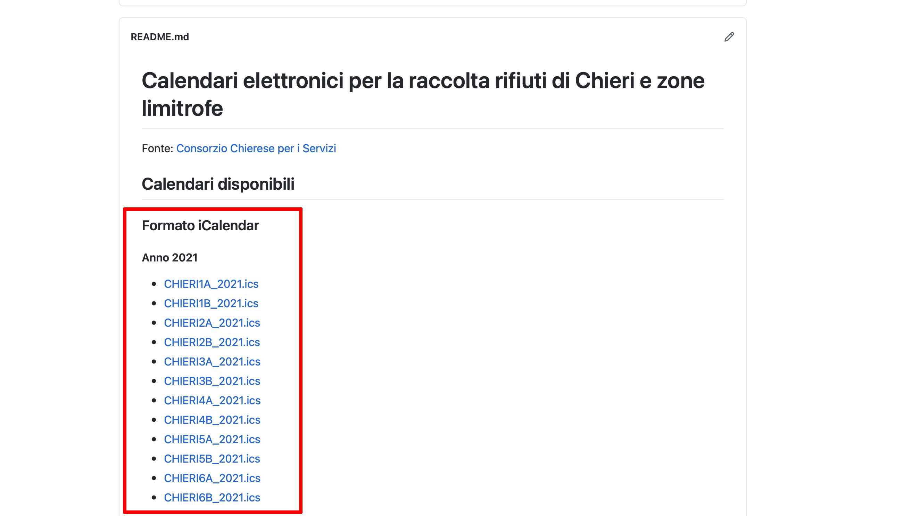
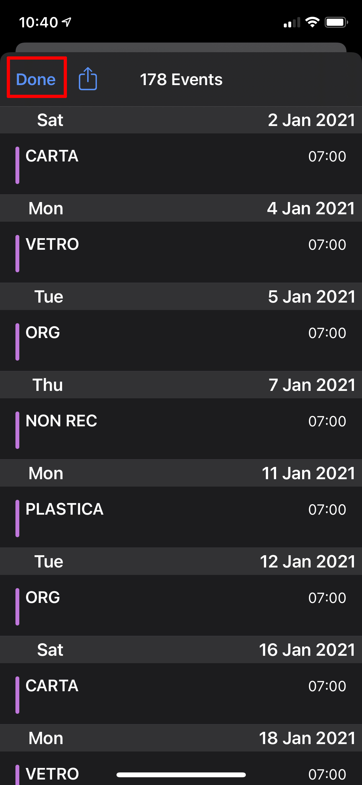
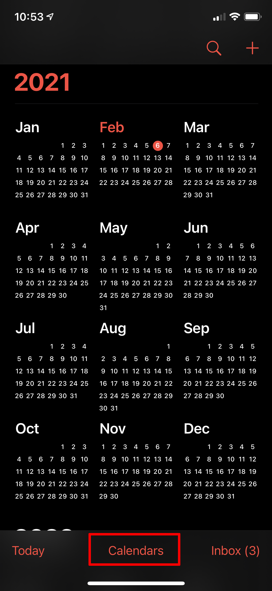
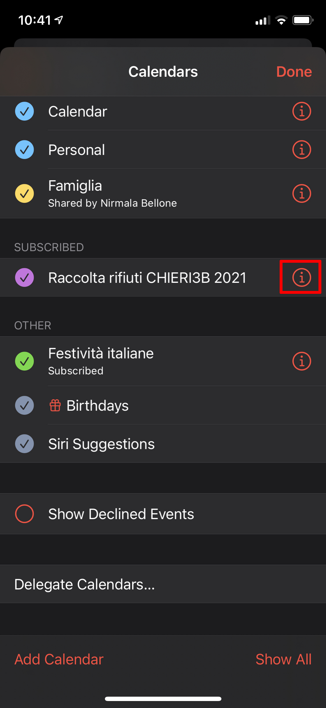
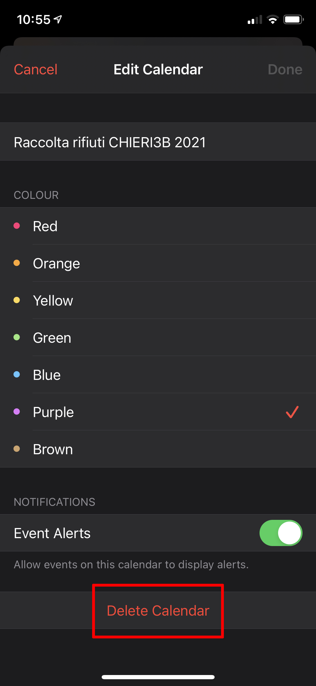

# Utilizzare i calendari di raccolta rifiuti con iOS Calendar su Apple iPhone e iPad

## Iscrizione al calendario della mia zona

Iscriversi ad un calendario significa visualizzare un calendario esterno tra quelli impostati su iCloud o sul iOS Calendar.

### Iscrizione al calendario

Per effettuare l'iscrizione ad un calendario di raccolta rifiuti su iPhone o iPad, visitare la home page di questo sito all'indirizzo https://github.com/sunnyvale-it/chieri-calendari-raccolta-rifiuti. 

Nella pagina principale identificare la zona d'interesse e cliccare sul relativo link al calendario in formato ICS (area della pagina evidenziata in rosso).

<kbd>
  
</kbd>

  

Un elenco di eventi viene visualizzato sullo schermo, confermare l'iscrizione ed uscire (area dello schermo evidenziata in rosso).

<kbd>
  
</kbd>

  

Il calendario ora compare tra quelli già impostati sul dispositivo.

<kbd>
  
</kbd>

  

### Notifica degli eventi

Gli eventi di raccolta verranno notificati alle ore 19:00 del giorno antecedente al conferimento.

### Cancellazione dell'iscrizione

E' possibile cancellare l'iscrizione ad un calendario di raccolta rifiuti. Dopo aver aperto l'applicazione Calendar sul proprio dispositivo, cliccare su **Calendari** (area dello schermo evidenziata in rosso).

<kbd>
  
</kbd>

  

Selezionare la **i** accanto al calendario da rimuovere (area dello schermo evidenziata in rosso).

<kbd>
  
</kbd>

  

Cliccare quindi su **Cancella calendario**

<kbd>
  
</kbd>

  