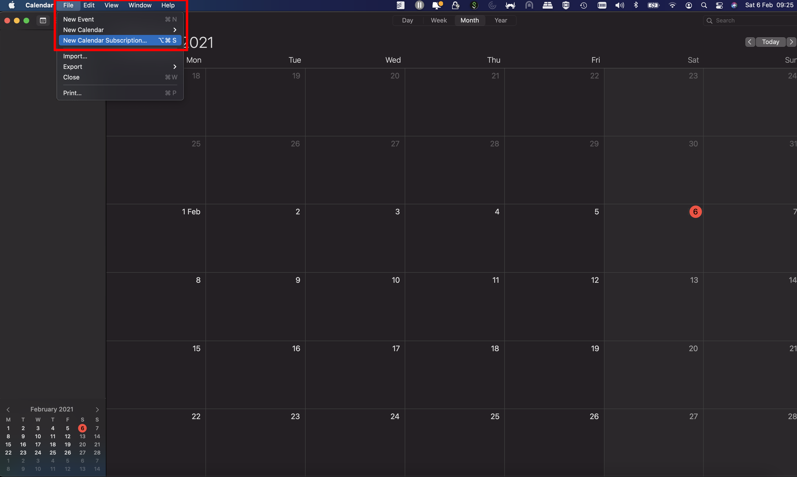
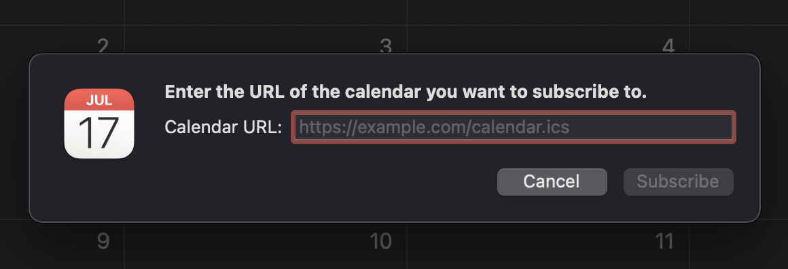
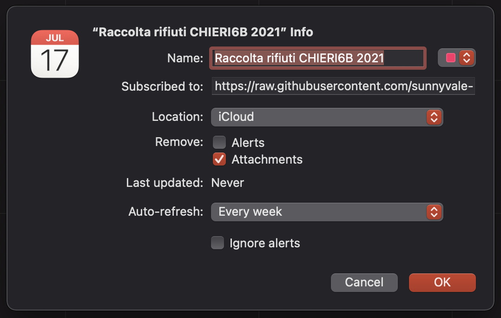
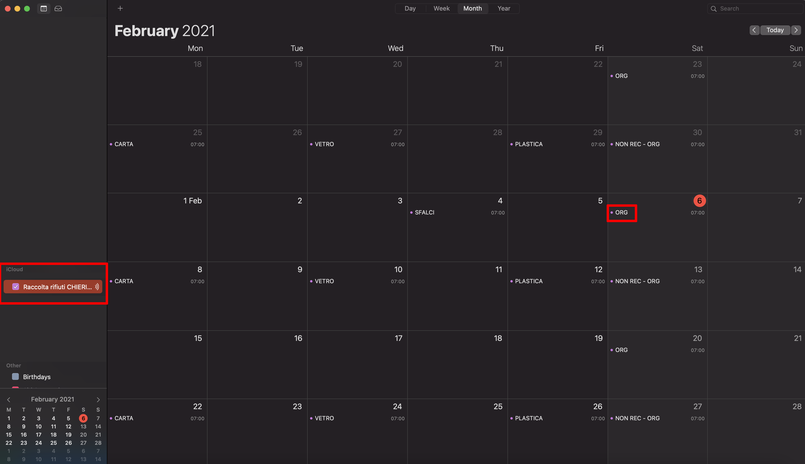
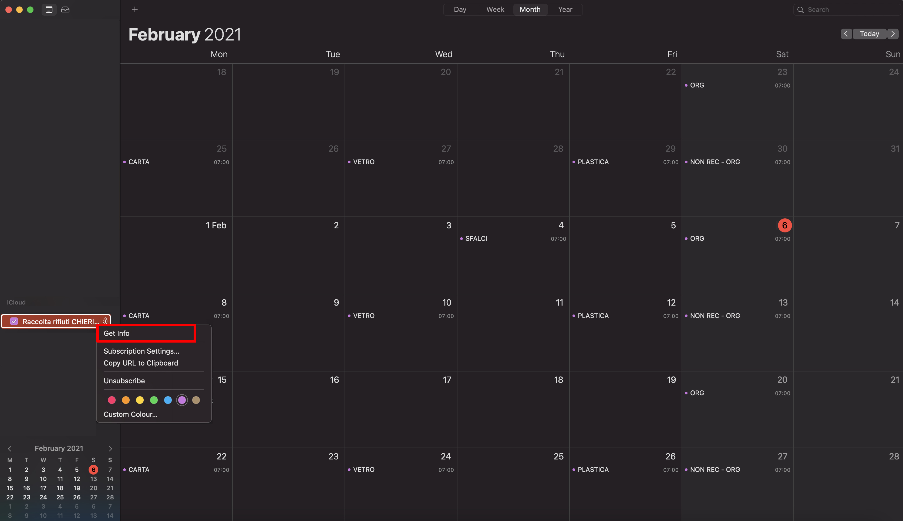
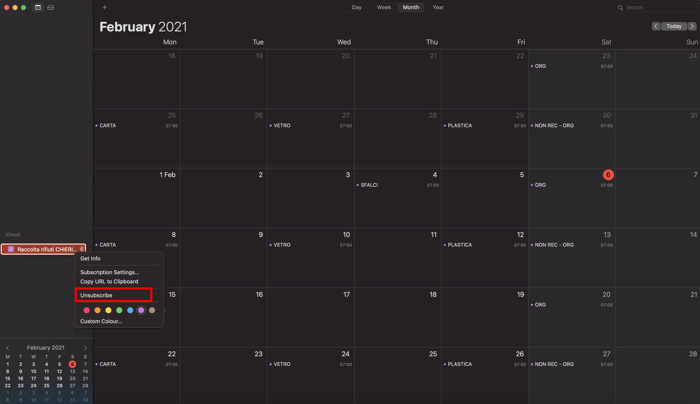

# Utilizzare i calendari di raccolta rifiuti con macOS Calendar su Apple Mac

## Iscrizione al calendario della mia zona

Iscriversi ad un calendario significa visualizzare un calendario esterno tra quelli impostati su iCloud o sul macOS Calendar.

### Iscrizione al calendario

Avvia l'app **Calendario** sul Mac, poi clicca su **File** > **Nuova iscrizione a calendario** (area dello schermo evidenziata in rosso).

<kbd>
  
</kbd>

  

Nella finestra che compare al centro dello schermo, inserire l'indirizzo URL del calendario al quale ci si intende iscrivere. 

L'indirizzo URL si può recuperare in due modi: 

1. [**Dalla pagina principale**](https://github.com/sunnyvale-it/chieri-calendari-raccolta-rifiuti): scorrendo troverete i calendari disponibili, cliccando sulla vostra zona di residenza si aprirà una nuova pagina, copiate l'URL (indirizzo nella barra di ricerca) e incollatelo nella casella "URL" del calendario.

2. **Manualmente**: gli indirizzi dei calendari delle varie zone (in formato ICS) hanno in generale tutti questo formato:

https://github.com/sunnyvale-it/chieri-calendari-raccolta-rifiuti/releases/download/\<ANNO\>-ICS/\<ZONA\>_\<ANNO\>.ics

Nell'indirizzo qui sopra occorre naturalmente sostituire i segnaposto **\<ANNO\>** con l'anno d'interesse e **\<ZONA\>** con la zona di residenza.

Un esempio di indirizzo URL del calendario di raccolta rifiuti per la zona **CHIERI3B** nell'anno 2021 risulta essere:

https://github.com/sunnyvale-it/chieri-calendari-raccolta-rifiuti/releases/download/2021-ICS/CHIERI3B_2021.ics

NB: Gli indirizzi a cui si fa riferimento sono quelli dei calendari in formato iCalendar (estensione .ics). La procedura NON funziona con gli indirizzi dei calendari in formato CSV.

  

Dopo aver inserito l'indirizzo del calendario, clicca su **Iscriviti**

<kbd>
  
</kbd>

  

Tramite la finestra illustrata qui di seguito, è possibile personalizzare l'iscrizione. 

In particolare consigliamo di togliere la spunta accanto alla voce **Rimuovi > Allarmi** per accettare le notifiche incluse nel calendario (normalmente impostate alle ore 19:00 del giorno antecedente al conferimento).

Alla voce **Posizione**, scegliere **iCloud** se si vuole condividere il calendario con altri dispositivi Apple registrati con lo stesso account Apple ID, oppure **Sul mio Mac**.

Ultimate le personalizzazioni, cliccare su **OK** per concludere l'iscrizione.

<kbd>
  
</kbd>

  

Il Calendario ora compare tra quelli personali e gli eventi di raccolta rifiuti vengono visualizzati (aree dello schermo evidenziate in rosso).

<kbd>
  
</kbd>

  

### Impostazioni dell'iscrizione

Per variare le impostazioni dell'iscrizione, dopo aver fatto click con il tasto destro del mouse sul calendario appena importato cliccare su **Ottieni informazioni**

<kbd>
  
</kbd>

  

Compariranno dunque le opzioni relative all'iscrizione del calendario di raccolta rifiuti, dopo averle personalizzate, cliccare su **OK**.

<kbd>
  
</kbd>

  

### Cancellazione dell'iscrizione

E' possibile cancellare l'iscrizione ad un calendario di raccolta rifiuti, dopo aver fatto click con il tasto destro del mouse sul calendario appena importato cliccare su **Annulla iscrizione** (area dello schermo evidenziata in rosso).

<kbd>
  
</kbd>

  

### Maggiori informazioni

Per maggiori informazioni consultare la guida ufficiale Apple all'indirizzo https://support.apple.com/it-it/guide/calendar/icl1022/mac