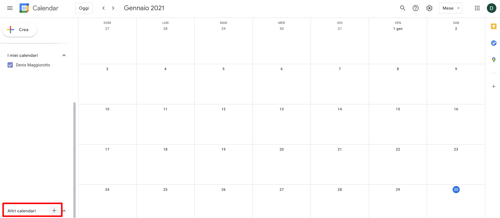
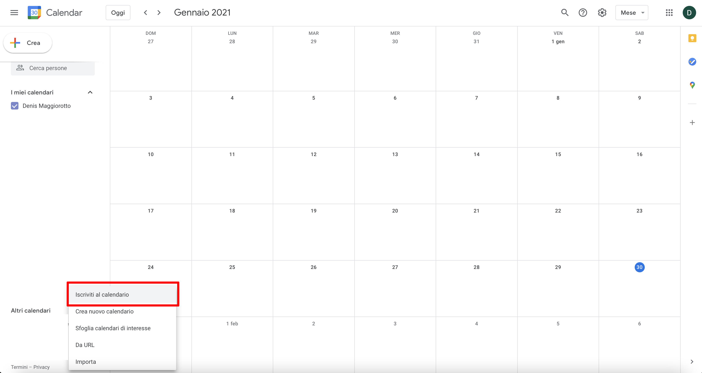
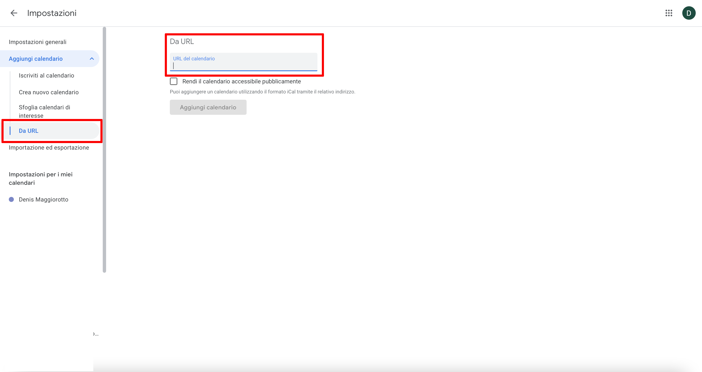
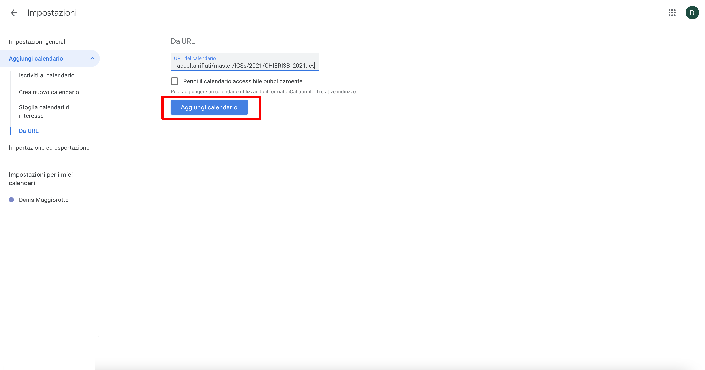
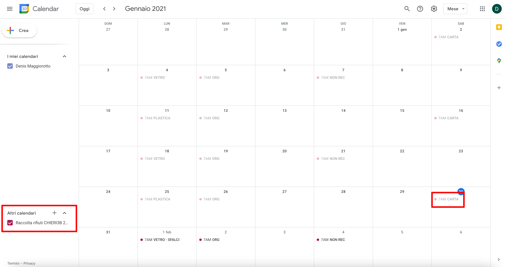
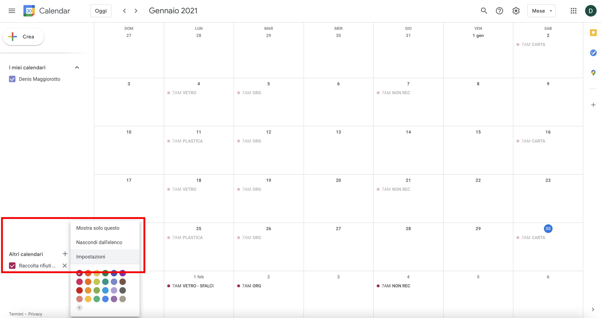
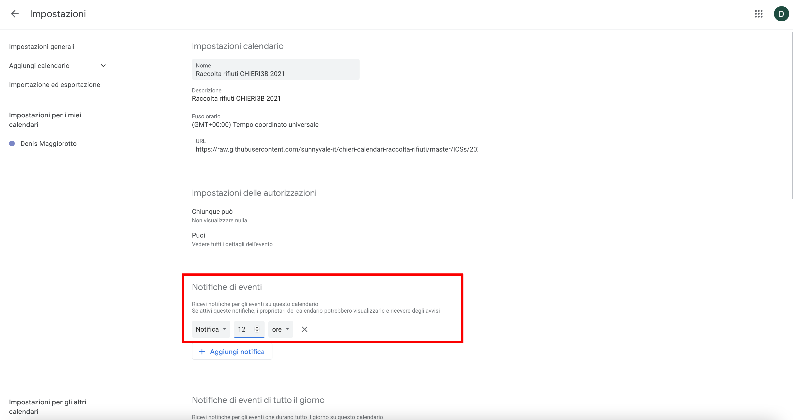
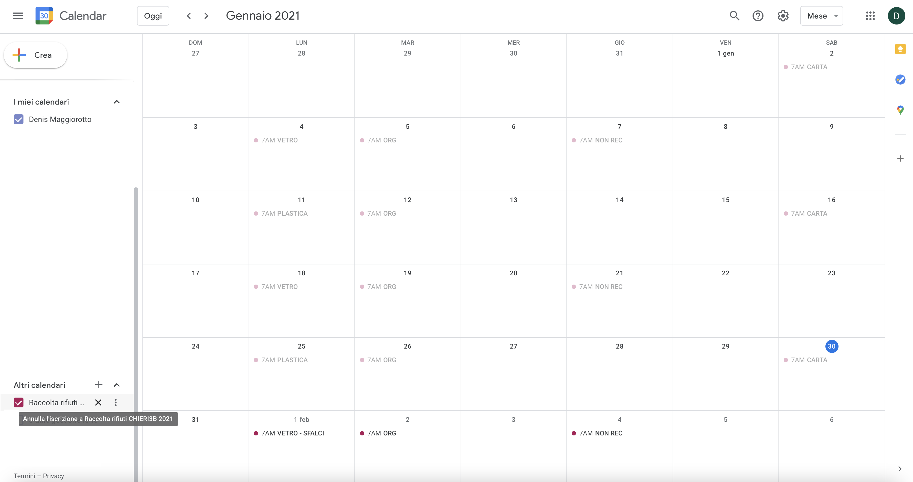

# Utilizzare i calendari di raccolta rifiuti con Google Calendar da PC o tablet

## Iscrizione al calendario della mia zona

### Iscrizione al calendario

Iscriversi ad un calendario significa visualizzare un calendario esterno tra quelli impostati sul vostro account Google.

Tramite un browser internet (Explorer, Firefox, Chrome, Edge, Opera) visualizzare il sito [https://calendar.google.com](https://calendar.google.com).

Se non ancora autenticati, il sito chiede di inserire username e password del vostro account Google (ad esempio quello che utilizzate per accedere alla casella di posta GMail), inserirli per procedere.

Subito dopo il login, la schermata mostra il calendario associato al vostro account Google.

Per iscriversi al calendario di raccolta rifiuti della vostra zona, cliccate sul tasto **+** in basso a sinistra, a fianco di **Altri calendari** (area dello schermo evidenziata in rosso).

<kbd>
  
</kbd>

Dal menù a tendina, selezionare **Iscriviti al calendario** (area dello schermo evidenziata in rosso).

<kbd>
  
</kbd>

Dal menù di sinistra selezionare **Da URL** e nella parte centrale inserire l'indirizzo del calendario a cui intendete iscrivervi (aree dello schermo evidenziate in rosso).

Gli indirizzi dei calendari (in formato ICS) delle varie zone sono quelli che compaiono ed in generale hanno tutti questo formato:

https://raw.githubusercontent.com/sunnyvale-it/chieri-calendari-raccolta-rifiuti/master/ICSs/**_ANNO_**/**_ZONA_**_**_ANNO_**.ics

Nell'indirizzo qui sopra occorre naturalmente sostituire i segnaposto **_ANNO_** con l'anno d'interesse e **_ZONA_** con la zona di residenza.

Un esempio di indirizzo del calendario della raccolta rifiuti per la zona **CHIERI3B** nell'anno **2021** risulta essere:

https://raw.githubusercontent.com/sunnyvale-it/chieri-calendari-raccolta-rifiuti/master/ICSs/2021/CHIERI6B_2021.ics

**NB:** Gli indirizzi a cui si fa riferimento sono quelli dei calendari in formato iCalendar (estensione .ics). La procedura NON funziona con gli indirizzi dei calendari in formato CSV.

<kbd>
  
</kbd>

Inserito l'indirizzo premere **Aggiungi calendario** (area dello schermo evidenziata in rosso)

<kbd>
  
</kbd>

Il calendario comparirà quindi tra gli altri calendari del vostro account Google e gli eventi verranno visualizzati nella parte centrale dello schermo (aree dello schermo evidenziate in rosso)

<kbd>
  
</kbd>

### Impostazione delle notifiche

Previa iscrizione al calendario come illustrato nel capitolo precedente, è possibile impostare delle notifiche automatiche ad ogni evento di raccolta.

Cliccando sui tre puntini che compaiono a fianco del calendario, selezionare la voce **Impostazioni** (area dello schermo evidenziata in rosso).

<kbd>
  
</kbd>

Nelle impostazioni del calendario, è possibile aggiungere delle **Notifiche di eventi**. L'esempio qui sotto illustra la volontà di ricevere una notifica 12 ore prima dell'evento di raccolta (tipicamente eseguito alle ore 7:00 del giorno di conferimento).

<kbd>
  
</kbd>

Più in basso nella stessa pagina è possibile impostare altri tipi di notifiche (area dello schermo evidenziata in rosso).

<kbd>
  
</kbd>

### Cancellazione dell'iscrizione

E' possibile cancellare l'iscrizione ad un calendario di raccolta rifiuti, cliccando sul tasto **X** che compare vicino al calendario (area dello schermo evidenziata in rosso).

<kbd>
  
</kbd>