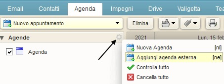
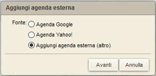
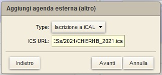
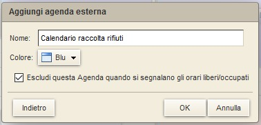
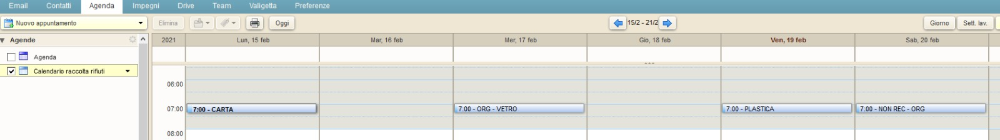

# Utilizzare i calendari di raccolta rifiuti con Zimbra da PC o tablet

## Iscrizione al calendario della mia zona

Iscriversi ad un calendario significa visualizzare un calendario esterno tra quelli impostati sul vostro account Zimbra.

### Iscrizione al calendario

Per iscriversi al calendario raccolta rifiuti della propria zona, subito dopo aver effettuato l'accesso su Zimbra cliccare sul tab **Agenda** e poi sull'icona a forma di ingranaggio come evidenziato nell'immagine che segue. 

Nel menù contestuale che comparirà, selezionare **Aggiungi agenda esterna**

<kbd>
  
</kbd>

  

In seguito, selezionare **Aggiungi agenda esterna (altro)**

<kbd>
  
</kbd>

  

In fase di selezione del tipo di calendario, selezionare **Iscrizione a iCAL** 

<kbd>
  
</kbd>

  

Viene richiesto l'indirizzo (URL) del calendario a cui ci si intende sottoscrivere. 

<kbd>
  
</kbd>

  

L'indirizzo URL si può recuperare in due modi: 

1. [**Dalla pagina principale**](https://github.com/sunnyvale-it/chieri-calendari-raccolta-rifiuti): scorrendo troverete i calendari disponibili, cliccando sulla vostra zona di residenza si aprirà una nuova pagina, copiate l'URL (indirizzo nella barra di ricerca) e incollatelo nella casella "URL" del calendario.

2. **Manualmente**: gli indirizzi dei calendari delle varie zone (in formato ICS) hanno in generale tutti questo formato:

https://github.com/sunnyvale-it/chieri-calendari-raccolta-rifiuti/releases/download/ANNO-ICS/ZONA_ANNO.ics

Nell'indirizzo qui sopra occorre naturalmente sostituire i segnaposto **ANNO** con l'anno d'interesse e **ZONA** con la zona di residenza.

Un esempio di indirizzo URL del calendario di raccolta rifiuti per la zona **CHIERI6B** nell'anno 2021 risulta essere:

https://github.com/sunnyvale-it/chieri-calendari-raccolta-rifiuti/releases/download/2021-ICS/CHIERI6B_2021.ics

NB: Gli indirizzi a cui si fa riferimento sono quelli dei calendari in formato iCalendar (estensione .ics). La procedura NON funziona con gli indirizzi dei calendari in formato CSV.

  

E' possibile assegnare al calendario un nome alternativo, così come un colore che contrassegnerà gli eventi in agenda.

Suggeriamo anche di contrassegnare **Escludi questa Agenda quando si segnalano gli orari di liberi/occupati**.

<kbd>
  
</kbd>

  

Cliccando su **OK** gli eventi vengono visualizzati in agenda

<kbd>
  
</kbd>

  

